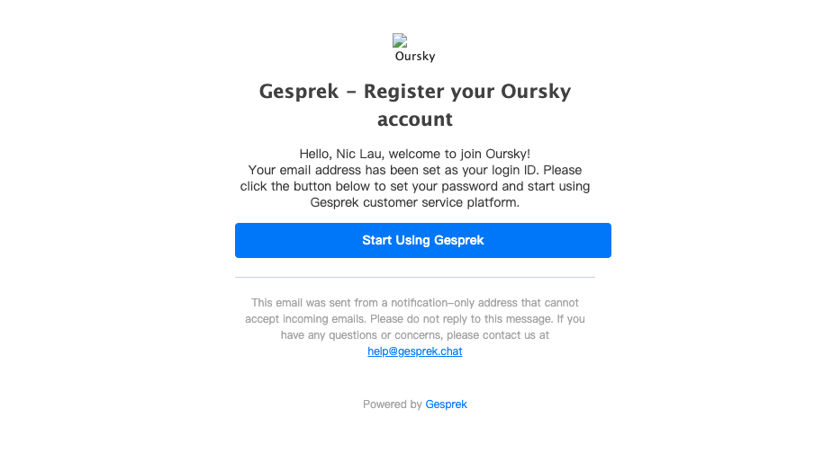

# Add a new staff

Once you have access to Gesprek's intuitive dashboard, you can start adding users or **Staff** who will manage your Gesprek account. 

Note that only the **Company Owner**, or **Company Admins** have the permission to add a **Staff** in Gesprek. 

Adding a Staff can be done with these very easy steps.

On the top right of your Gesprek dashboard, select your profile. Under **Settings**, click **Manage staff**. You will be redirected to a list of your current staff. On the top right, select **Create staff**. You will be prompted to configure the Staff's **User Role** or permissions, and fill in the staff's phone number and the email that will be used to log in to your company's Gesprek account. Once you confirm the information, click **Send and save** to send a registration invitation to the email address and save the staff's profile.



Once your staff receives the email, they can click on the "**Start using Gesprek**" button. 

The user or staff will be redirected to a page for setting the password for their access to the Gesprek account. Alternatively, users can change their passwords by going to their profile and clicking **Account**. We recommend that users use a strong password for their Gesprek account.



Your staff can now start using Gesprek's social commerce capabilities!

